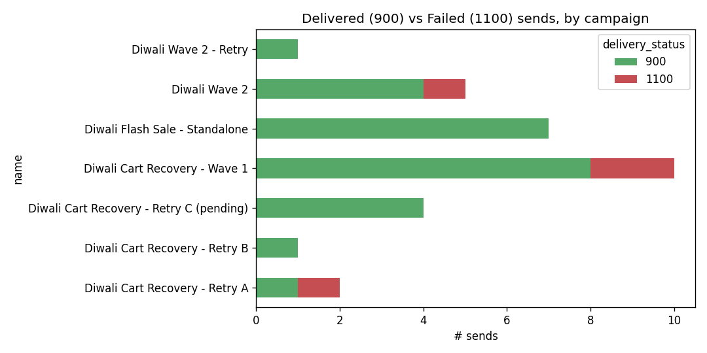

# Xeno Data Analyst Internship Drive 2026 : Assignment

## Approach

I created `target_base_eda` jupyter notebook to get the feel of the dataset and explore the data to undestand the patterns and insights for the actual problem statement.

Using the finding from the notebook, `query.sql` is where i turned eachh finding into a filter. The order of operations is as follows:

1. Loaded both the csv files via `pandas` and performed descriptive analysis checking shape/dtypes/nulls &ndash; expected `parent_id` null on top-level campaigns.

2. Looked at `campaign.creation_status ` x `processing_status` and found one campaign (`9004`) registered as `approval_awaiting`, not `approved`.

3. Looked at `delivery_status` value counts (**900** : 26, **1100** : 4) and verified their meaning in context to the campaigns.
   
   1. **Mapping: `900` = delivered, `1100` = failed/undelivered.** Retry campaigns exist specifically to re-attempt customers whose previous send came back `1100`.

4. Merged `communication_log` with `campaign` and sorted by customer to uncover that customers `C2`, `C3`, `D1` each appear more than once, always inside a campaign- retry pair, and the first (parent-campaign) send is `1100` while the retry's send is `900`. This implies a failure-retry-sucess chain.

5. Checked `9004`'s own rows (`C11`-`C14`) against that pattern &ndash; they're `900` on the very first send, meaning `9004` isn't actually retrying a prior failure which implies it doesn't change the count as it is already excluded on approval status and explains why it isn't a normal retry.

6. Checked for duplicate (`communication_id, customer_id`) pairs and found `C20` sent twice under `9101` as a standalone, non-retry campaign 10 days apart with both being 900. Confirmed as two legitimate sends, not a dedup issue.

7. Finally the stacked bar chart (`delivery_by_campaign`) made the retry pattern visible at a glance via visual confirmation that red (1100) only shows up in `Wave 1`, `Retry A`,  and `Wave 2` with fully disappearing by the last retry in each chain while `Retry C (pending)` and `Flash Sale` being all-green with no failures.  



## Reconciliation Bridge

| Step | Description                                                                                                         | Result         | Reason                                                                                                                                 |
|:----:| ------------------------------------------------------------------------------------------------------------------- |:--------------:| -------------------------------------------------------------------------------------------------------------------------------------- |
| 0    | Naive count: all `communication_log` rows joined to campaigns named `%Diwali%` under  merchant 501 in October 2026. | 30             | Starting Point                                                                                                                         |
| 1    | Checked `MIN`/`Max (sent_time)` to make sure that all campaigns fall between October 10 to October 20.              | 30 (no change) | To measure the impact of date filter being a plausible source of gap.                                                                  |
| 2    | Checked `delivery_status` value counts.                                                                             | 30 (no change) | Found 900 (26 times) and 1100 (4 times) with no impact.                                                                                |
| 3    | Traced repeat customers (`C2`, `C3`, `D1`) across a campaign and its retry.                                         | 30 (no change) | Confirmed 900 = deliverd, 1100 = failed. Implies it is a plausible filter.                                                             |
| 4    | Excluded campaign `9004` since it was the only campaign with `creation_status` as 'approval_waiting'.               | 26             | Since the campaign wasn't yet approved, it shouldn't be included in the final count.                                                   |
| 5    | Checked whether `9004`'s sends were genuine failure retries.                                                        | 26 (no change) | `C11`-`C14` succeeded on the first attempt verifying that `9004` isn't a retrying a failure.                                           |
| 6    | Checked for duplicate `(campaign, customer)` sends                                                                  | 26 (no change) | `C20` sent twice under `9101` 10 days apart with both having `delivery_status` = 900 implying genuine second send and not a duplicate. |
| 7    | Finally excluded the `delivery_status = 1100` (failed/undeliverd) rows.                                             | **22**         | The final number should only count actual deliveries, not failed first attempts that were later retried.                               |

#### This is the final SQL query that gives *22* as the result.

```sql
SELECT COUNT(*) as approved_campaigns_delivered FROM communication_log cl
JOIN campaign c ON cl.communication_id = c.id
WHERE c.merchant_id = 501 AND c.name LIKE '%Diwali%'
AND c.creation_status = 'approved'
AND cl.delivery_status = 900;
```

> Full SQL workflow
> 
> ```sql
> SELECT * FROM campaign;
> SELECT * FROM communication_log LIMIT 10;
> --
> 
> SELECT COUNT(*) FROM campaign;
> SELECT COUNT(*) FROM communication_log;
> --
> 
> SELECT MIN(sent_time), MAX(sent_time) FROM communication_log;
> --
> 
> SELECT creation_status, COUNT(*) FROM campaign GROUP BY creation_status;
> SELECT processing_status, COUNT(*) FROM campaign GROUP BY processing_status;
> SELECT delivery_status, COUNT(*) FROM communication_log GROUP BY delivery_status;
> --
> 
> SELECT id, parent_id, name, creation_status, processing_status
> FROM campaign
> WHERE merchant_id = 501
> ORDER BY id;
> --
> 
> SELECT c.id, c.name, c.creation_status, COUNT(cl.id) AS n_sends
> FROM campaign c
> LEFT JOIN communication_log cl ON cl.communication_id = c.id
> WHERE c.merchant_id = 501
> GROUP BY c.id, c.name, c.creation_status
> ORDER BY c.id;
> --
> 
> SELECT COUNT(*) as target_base FROM communication_log cl
> JOIN campaign c ON cl.communication_id = c.id
> WHERE c.merchant_id = 501 AND c.name LIKE '%Diwali%';
> --
> 
> SELECT COUNT(*) as approved_campaigns FROM communication_log cl
> JOIN campaign c ON cl.communication_id = c.id
> WHERE c.merchant_id = 501 AND c.name LIKE '%Diwali%'
> AND c.creation_status = 'approved';
> --
> 
> SELECT COUNT(*) as approved_campaigns_delivered FROM communication_log cl
> JOIN campaign c ON cl.communication_id = c.id
> WHERE c.merchant_id = 501 AND c.name LIKE '%Diwali%'
> AND c.creation_status = 'approved'
> AND cl.delivery_status = 900;
> ```


